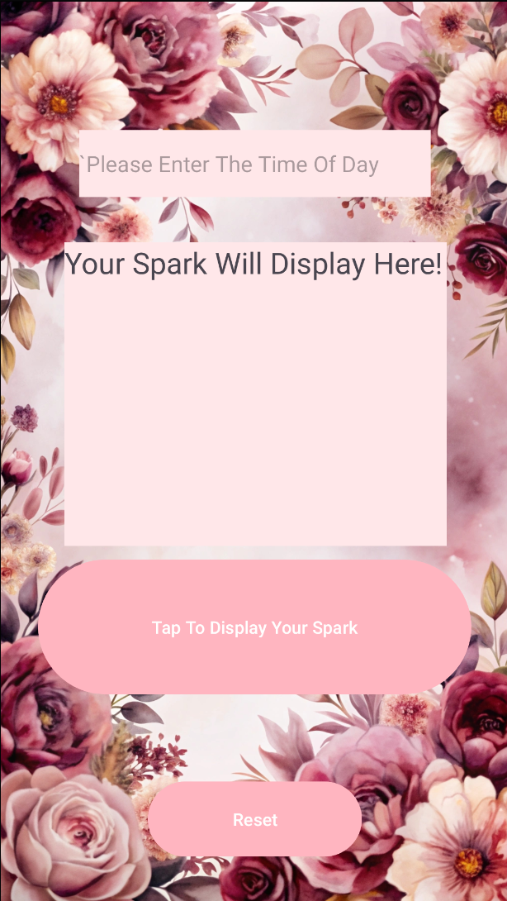

# IMAD-assignment-1-third-try-
🌸 Spark App
📱 Overview

Spark is a simple and visually calming Android app that generates social suggestions (“sparks”) based on the time of day. It encourages users to connect with others and take small, meaningful actions throughout their day.

🎯 Purpose

The goal of Spark is to:

Encourage positive social interaction

Promote mental well-being and mindfulness

Provide quick, actionable suggestions

Create a pleasant and stress-free user experience

✨ Features

⏰ Time-of-day input (e.g., morning, afternoon, night)

💡 Dynamic “spark” suggestions

🎨 Soft floral-themed interface

👆 One-tap interaction to generate a spark

🔁 Reset button to try again

🖼️ App Screenshot

💡 Example Sparks

Here are some examples of suggestions the app provides:

🌅 Morning: "Send a 'Good Morning' text to a family member!"

☀️ Afternoon: "Share a funny Meme or interesting link with a friend!"

🌙 Night: "Leave a thoughtful comment on a friend's post"

🧠 How It Works

The user enters a time of day.

When the button is tapped, the app:

Processes the input

Selects a matching suggestion

The “spark” is displayed on screen.

The user can press Reset to try again.

🎨 Design Considerations
1. User Experience (UX)

Simple and intuitive flow

Minimal input required

Instant feedback when generating a spark

2. Visual Design

Soft pink and floral background for a calming aesthetic

Rounded buttons to create a friendly interface

Clear text hierarchy for readability

3. Accessibility

Large touch targets for buttons

Readable font sizes and contrast

Straightforward interaction with minimal complexity

⚙️ Technologies Used

Language: Kotlin

IDE: Android Studio

Platform: Android

Version Control: Git & GitHub

Automation: GitHub Actions

🔧 GitHub Usage

GitHub was used to:

Store and manage the project code

Track changes through commits

Maintain version history

Enable easy sharing and submission

Workflow

Regular commits to document progress

Clear commit messages describing changes

Organized project structure for readability

🚀 GitHub Actions

GitHub Actions was used to automate parts of the development process.

Implemented/Planned Automations:

✅ Automatic build checks on push

✅ Code validation

Benefits:

Ensures the app builds correctly

Helps catch errors early

Improves overall code quality

Youtube video showcase:
https://www.youtube.com/watch?v=0bjuXXxG4cc

